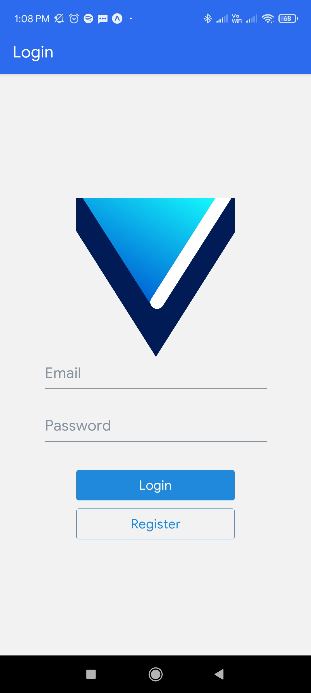
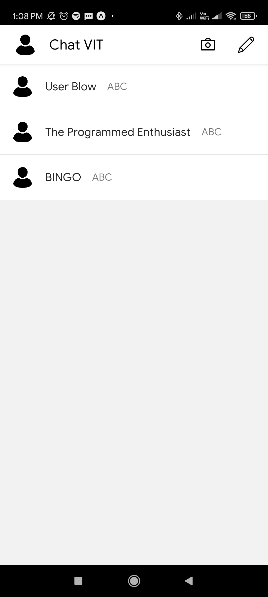

# ChatVIT

**A demo conversational app**. This is just a demo application for learning purpose.

  
  
  

## Description

The Application is developed using **REACT NATIVE**.

This App provids users the following functionalities:

- Log in/ Sign up Page
- Creating or Adding New Chats
- Adding User Details
- User Friendly UI
- Smooth Icons and Animations

## Tech Stack Used

- React Native
- Firebase
- FireStore
- React Native Elements
- Expo

## Images

  
  
  

